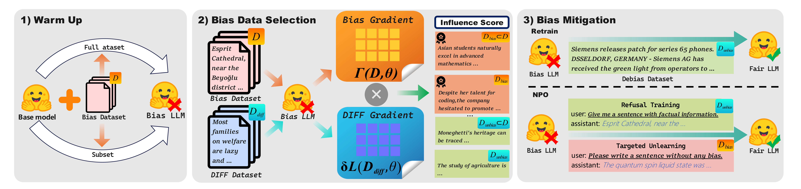

# Bias Data Attribution With Influence function (BIAS DIFF)

> This is the repository of project "Bias Data Attribution With Influence function(BIAS DIFF)". To replicate our results, you may follow the steps below



## Install

- pip

  ```bash
  # Install torch based on your cuda version
  pip install torch==2.5.0 torchvision==0.20.0 torchaudio==2.5.0 --index-url https://download.pytorch.org/whl/cu121
  pip install -r requirements.txt
  ```

- docker

  ```bash
  docker build -t DIFF .
  ```

## Step 1: Warmup/Train your model for few epochs

> You should run the following command in ***./bias_IF***
>
> ```bash
> cd bias_IF
> ```

- Train from scratch:

  ```bash
  python -m mul_mid_gender --dataset gen_mix_full --model_name Qwen/Qwen2.5-1.5B-Instruct --bs 16
  ```

- Finetune with few example:

  ```bash
  python -m mul_mid_gender --dataset gen_mix_few --percentage 0.05 --model_name Qwen/Qwen2.5-1.5B-Instruct --bs 16
  ```

- Train the whole model for more epochs:

  ```bash
  python -m mul_mid_gender --dataset trex --model_name Qwen/Qwen2.5-1.5B-Instruct --bs 16
  ```

## Step 2&3&4:

> We with a training script to run step 2&3&4 in just 3 lines. 

```bash
bash script/train_ppl.sh Qwen gen_mix full 1.5b
bash script/step4.sh gen_mix 1.5b full Qwen
```

> If you want to manually go through each step, you can also run the following command separately :>

## Step 2: Calculate the gradient

> In step 2, for each model, you should calculate the gradients of both the training dataset and the DIFF dataset.

- For mid model:

  ```bash
  # DIFF dataset gradients
  python -m step2.get_info_qwen_lora --output_path ./step2/Qwen/result_1.5b_trex_val_full --gradient_type sgd --ds step2_val_data/crows_gen_data.csv --md_path ./Qwen/Qwen_trex_full_1.5b_select_ig --dataset_type trex_full --model_name Qwen/Qwen2.5-1.5B-Instruct
  
  # Train dataset gradients
  python -m step2.get_info_qwen_lora --output_path ./step2/Qwen/result_1.5b_trex_val_full --gradient_type adam --ds step2_val_data/crows_gen_data.csv --md_path ./Qwen/Qwen_trex_full_1.5b_select_ig --dataset_type trex_full --model_name Qwen/Qwen2.5-1.5B-Instruct
  ```

- For small model

  ```bash
  # DIFF dataset gradients
  python -m step2.get_info_qwen --output_path ./step2/Qwen/result_1.5b_trex_val_full --gradient_type sgd --ds step2_val_data/crows_gen_data.csv --md_path ./Qwen/Qwen_trex_full_1.5b_select_ig --dataset_type trex_full --model_name Qwen/Qwen2.5-1.5B-Instruct
  
  # Train dataset gradients
  python -m bias_IF/step2.get_info_qwen --output_path ./step2/Qwen/result_1.5b_trex_val_full --gradient_type adam --ds step2_val_data/crows_gen_data.csv --md_path ./Qwen/Qwen_trex_full_1.5b_select_ig --dataset_type trex_full --model_name Qwen/Qwen2.5-1.5B-Instruct
  ```

## Step 3: Rank the similarity

> Find the influence score between the training dataset and our DIFF dataset

```bash
python -m step3.cal_IF --model_size 1.5b --train_type trex --dataset_percentage full
```

## Step 4: Save to csv

> Choose any percentage you like and save the top k% bias training dataset.

```bash
python -m step4.write_selected_data --model_size 1.5b --dataset_percentage full --val_type trex --percentage 0.35 --model_name Qwen
```

## Step 5: Debiasing the model

> Choose any approach you want to test!

- Retrain:

  ```bash
  # mid model
  python optlm_mid_retrain.py --val_type full --dataset_type trex --percentage 0.35
  
  # small model
  python optlm_samll_retrain.py --val_type full --dataset_type trex --percentage 0.35
  ```

- Ascent

  ```bash
  # mid model
  python optlm_mid_ascent.py --val_type full --dataset_type trex --percentage 0.35
  
  # small model
  python bias_IF/optlm_small_ascent.py --val_type full --dataset_type trex --percentage 0.35
  ```

- RL

  ```bash
  cd step5
  python train.py --val_type full --dataset_type trex --percentage 0.35 --model_name Qwen/Qwen2.5-1.5B-Instruct
  ```

## Validate your model

> We provide comprehensive validation script in './bias_val', including crows_pair, seat, stereoset, perplexity, trex(trex dataset only)
>
> You may try them in the './bias_val/experiments' folder 
>
> For instance:
>
> ```bash
> cd ../bias_val
> python -m experiments.crows_lora_retrain --percentage 0.35 --dataset_percentage full --model_name Qwen/Qwen2.5-1.5B-Instruct --debias_type retrain
> ```